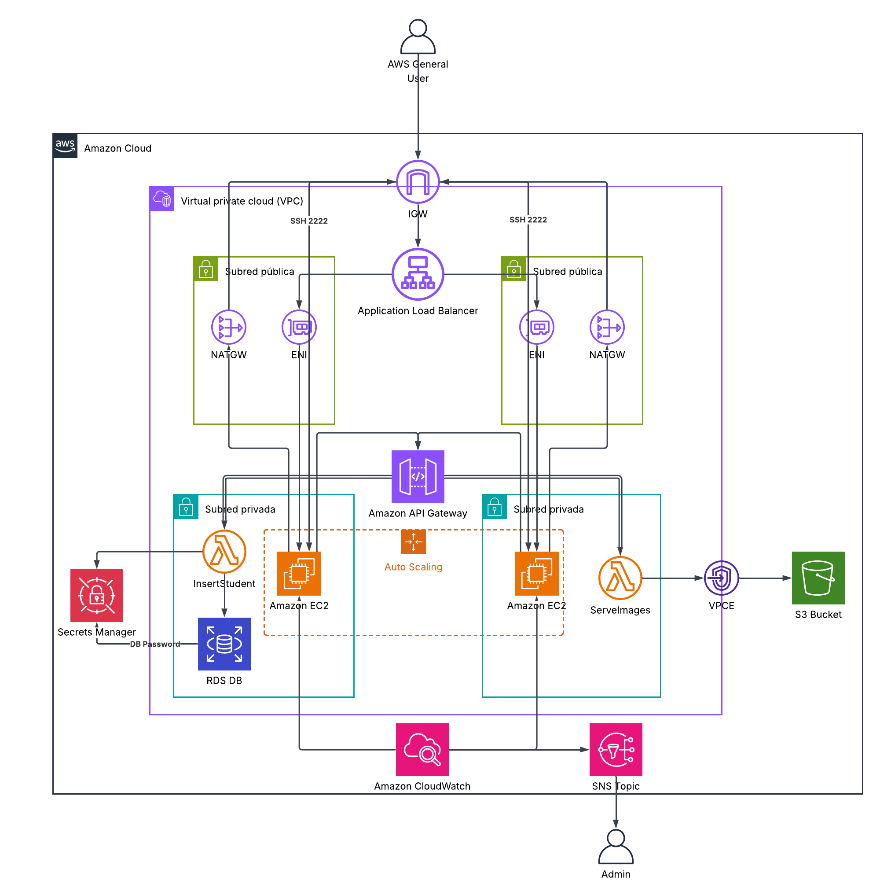

# NexaCloud AWS Infrastructure - Technical Architecture Report

> **Document Version**: 1.0  
> **Last Updated**: 2026-05-29  
> **Project**: NexaCloud AWS Infrastructure Migration  
> **Status**: Pilot Phase

---

## Executive Summary

This document describes the AWS infrastructure architecture for NexaCloud's pilot intranet migration from on-premise to cloud. The architecture follows AWS best practices including security-first design, high availability, and cost optimization.

**Key Characteristics:**
- **Region**: us-east-1 (N. Virginia)
- **VPC CIDR**: 10.0.0.0/16
- **Availability Zones**: 2 (us-east-1a, us-east-1b)
- **High Availability**: Multi-AZ RDS, dual NAT Gateways, ASG with 2-5 instances
- **Security**: SSH on port 2222, API Key authentication, private subnets for compute

---



## Architecture Overview

### Network Topology

```
┌─────────────────────────────────────────────────────────────────────────────┐
│                           VPC: nexacloud-vpc (10.0.0.0/16)                  │
│                                                                             │
│  ┌─────────────────────────────────────────────────────────────────────┐    │
│  │                          PUBLIC SUBNETS                              │    │
│  │                                                                       │    │
│  │   ┌─────────────────────┐         ┌─────────────────────┐           │    │
│  │   │   Public Subnet     │         │   Public Subnet     │           │    │
│  │   │   AZ1 (10.0.1.0/24)  │         │   AZ2 (10.0.2.0/24) │           │    │
│  │   │                      │         │                      │           │    │
│  │   │  ┌────────────────┐  │         │  ┌────────────────┐  │           │    │
│  │   │  │   NAT GW 1     │  │         │  │   NAT GW 2     │  │           │    │
│  │   │  │  (EIP assigned)│  │         │  │  (EIP assigned)│  │           │    │
│  │   │  └────────────────┘  │         │  └────────────────┘  │           │    │
│  │   │                      │         │                      │           │    │
│  │   │  ┌────────────────┐  │         │  ┌────────────────┐  │           │    │
│  │   │  │      ALB       │  │         │  │                │  │           │    │
│  │   │  │  (Port 80/HTTP)│  │         │  │                │  │           │    │
│  │   │  └────────────────┘  │         │  └────────────────┘  │           │    │
│  │   │                      │         │                      │           │    │
│  │   └─────────────────────┘         └─────────────────────┘           │    │
│  │                                                                      │    │
│  └─────────────────────────────────────────────────────────────────────┘    │
│                                    │                                        │
│                                    │                                        │
│  ┌─────────────────────────────────────────────────────────────────────┐    │
│  │                         PRIVATE SUBNETS                             │    │
│  │                                                                       │    │
│  │   ┌─────────────────────┐         ┌─────────────────────┐           │    │
│  │   │   Private Subnet    │         │   Private Subnet    │           │    │
│  │   │   AZ1 (10.0.10.0/24)│◄────────►│   AZ2 (10.0.20.0/24)│           │    │
│  │   │                      │   RDS   │                      │           │    │
│  │   │  ┌────────────────┐ │ Standby │  ┌────────────────┐  │           │    │
│  │   │  │  Lambda         │ │         │  │  Lambda        │  │           │    │
│  │   │  │  insert-student │ │         │  │  serve-images  │  │           │    │
│  │   │  └────────────────┘ │         │  └────────────────┘  │           │    │
│  │   │                      │         │                      │           │    │
│  │   │  ┌────────────────┐  │         │                      │           │    │
│  │   │  │  RDS Primary   │  │         │                      │           │    │
│  │   │  │  PostgreSQL    │  │         │                      │           │    │
│  │   │  │  (Port 9876)   │  │         │                      │           │    │
│  │   │  └────────────────┘  │         │                      │           │    │
│  │   └─────────────────────┘         └─────────────────────┘           │    │
│  │                                                                      │    │
│  └─────────────────────────────────────────────────────────────────────┘    │
│                                                                             │
│  ┌─────────────────────────────────────────────────────────────────────┐    │
│  │                           EXTERNAL                                   │    │
│  │                                                                       │    │
│  │   ┌─────────────────────┐                                            │    │
│  │   │    Internet         │◄──── IGW (nexacloud-igw)                  │    │
│  │   │    0.0.0.0/0        │                                            │    │
│  │   └─────────────────────┘                                            │    │
│  │                                                                       │    │
│  │   ┌─────────────────────┐                                            │    │
│  │   │    S3 Bucket        │◄──── VPC Endpoint (Gateway)               │    │
│  │   │  nexacloud-        │                                            │    │
│  │   │  employee-images   │                                            │    │
│  │   └─────────────────────┘                                            │    │
│  │                                                                       │    │
│  └─────────────────────────────────────────────────────────────────────┘    │
│                                                                             │
└─────────────────────────────────────────────────────────────────────────────┘
```

---

## Security Architecture

### Security Controls Summary

| Component | Security Control | Implementation | Port/Protocol |
|-----------|-----------------|----------------|---------------|
| SSH Access | Restricted Port | Only from office IP 152.203.67.246/32 | TCP/2222 |
| API Gateway | API Key | Required `x-api-key` header | HTTPS |
| S3 Bucket | Private by Default | Block all public access + bucket policy | - |
| RDS Database | Security Group | Port 9876 from VPC CIDR only (10.0.0.0/16) | TCP/9876 |
| Lambda Functions | VPC Placement | Private subnets, no internet direct | - |
| EC2 Instances | Security Group | Port 80 from ALB, SSH restricted | TCP/80, TCP/2222 |
| ALB | Security Group | HTTP 80 from 0.0.0.0/0 | TCP/80 |

### IAM Roles and Policies

| Role | Purpose | Key Permissions |
|------|---------|----------------|
| `nexacloud-lambda-rds` | Lambda → RDS access | `rds-db:connect`, `secretsmanager:GetSecretValue` |
| `nexacloud-lambda-insert-student` | InsertStudentLambda | `secretsmanager:GetSecretValue`, `rds-db:connect` |
| `nexacloud-lambda-images` | ServeImagesLambda | `s3:GetObject`, `s3:ListBucket` |
| `nexacloud-ec2` | EC2 instance profile | `ssm:StartSession`, `cloudwatch:PutMetricData` |

---

## High Availability Design

### Multi-AZ Deployment

```
                    ┌─────────────────────────────────────┐
                    │         Route53 / ALB               │
                    │   (Health Checks + DNS Failover)    │
                    └─────────────────┬─────────────────┘
                                      │
                    ┌─────────────────▼─────────────────┐
                    │         AZ1          │    AZ2       │
                    │   ┌───────────┐     │  ┌──────────┐│
                    │   │  NAT GW   │◄────┼─►│ NAT GW   ││
                    │   └───────────┘     │  └──────────┘│
                    │          │          │              │
                    │   ┌──────▼──────┐   │  ┌──────────┐│
                    │   │  EC2 ASG    │   │  │  (Standby)││
                    │   │  (2-5 ins)  │   │  │          ││
                    │   └─────────────┘   │  └──────────┘│
                    │                      │                │
                    │   ┌──────────────┐ │  ┌──────────┐│
                    │   │ RDS Primary   │─┼──│RDS Standby││
                    │   │ (Port 9876)   │ │  │(Automatic ││
                    │   └──────────────┘ │  │ Failover) ││
                    └─────────────────────┘  └───────────┘│
                                    │
                    ┌───────────────▼─────────────────────┐
                    │            Lambda Functions          │
                    │   (Both AZs, zipped deployments)     │
                    └─────────────────────────────────────┘
```

### Failure Recovery

| Component | Failure Mode | Recovery |
|-----------|-------------|---------|
| EC2 Instance | Hardware failure | ASG automatically terminates and replaces |
| AZ Failure | Power/network loss | ASG scales up in remaining AZ |
| RDS Primary | AZ failure | Multi-AZ automatic failover (~60 seconds) |
| NAT GW | AZ failure | Traffic routes via second AZ NAT GW |
| Lambda | Function error | CloudWatch alarms + SNS notifications |

---

## Lambda Function Flows

### Insert Student Data Flow

```
┌──────────────┐      ┌──────────────┐      ┌──────────────┐
│  Next.js     │      │  API Gateway │      │   Lambda     │
│  Application │─────▶│  (REST API)  │─────▶│insert-student│
│              │ POST │  /estudiante │      │              │
└──────────────┘      └──────────────┘      └──────┬───────┘
                                                     │
                                                     │ Get Secret
                                                     ▼
                                            ┌──────────────┐
                                            │ Secrets      │
                                            │ Manager      │
                                            │ (DB Password)│
                                            └──────┬───────┘
                                                     │
                                                     │ Connect
                                                     ▼
                                            ┌──────────────┐
                                            │    RDS       │
                                            │  PostgreSQL  │
                                            │  (Port 9876) │
                                            └──────┬───────┘
                                                     │
                                                     │ INSERT
                                                     ▼
                                            ┌──────────────┐
                                            │ estudiante   │
                                            │ table        │
                                            └──────────────┘
```

### Get Employee Images Flow

```
┌──────────────┐      ┌──────────────┐      ┌──────────────┐
│  Next.js     │      │  API Gateway │      │   Lambda     │
│  Application │─────▶│  (REST API)  │─────▶│serve-images  │
│              │ GET  │  /images     │      │              │
└──────────────┘      └──────────────┘      └──────┬───────┘
                                                     │
                                                     │ List Objects
                                                     ▼
                                            ┌──────────────┐
                                            │  S3 Bucket   │
                                            │nexacloud-    │
                                            │employee-     │
                                            │images        │
                                            │(via VPC      │
                                            │ Endpoint)    │
                                            └──────┬───────┘
                                                     │
                                                     │ Generate
                                                     │ Presigned URLs
                                                     ▼
                                            ┌──────────────┐
                                            │ Return       │
                                            │ Image URLs   │
                                            │ (24hr expiry)│
                                            └──────────────┘
```

---

## Services Inventory

### Network Resources

| Service | Resource Name | Configuration |
|---------|---------------|---------------|
| VPC | `nexacloud-vpc` | 10.0.0.0/16 |
| Public Subnet 1 | `nexacloud-public-1` | 10.0.1.0/24, AZ1 |
| Public Subnet 2 | `nexacloud-public-2` | 10.0.2.0/24, AZ2 |
| Private Subnet 1 | `nexacloud-private-1` | 10.0.10.0/24, AZ1 |
| Private Subnet 2 | `nexacloud-private-2` | 10.0.20.0/24, AZ2 |
| Internet Gateway | `nexacloud-igw` | Attached to VPC |
| NAT Gateway 1 | `nexacloud-nat-1` | EIP, AZ1 |
| NAT Gateway 2 | `nexacloud-nat-2` | EIP, AZ2 |
| Public Route Table | `nexacloud-public-rt` | 0.0.0.0/0 → IGW |
| Private Route Table 1 | `nexacloud-private-rt-1` | 0.0.0.0/0 → NAT GW 1 |
| Private Route Table 2 | `nexacloud-private-rt-2` | 0.0.0.0/0 → NAT GW 2 |
| S3 VPC Endpoint | `nexacloud-s3-vpce` | Gateway type |
| DynamoDB VPC Endpoint | `nexacloud-dynamodb-vpce` | Gateway type |

### Compute Resources

| Service | Resource Name | Configuration |
|---------|---------------|---------------|
| EC2 Security Group | `nexacloud-ec2-sg` | TCP/2222 (office), TCP/80 (ALB) |
| ALB Security Group | `nexacloud-alb-sg` | TCP/80 (0.0.0.0/0) |
| IAM Role (EC2) | `nexacloud-ec2-role` | SSM, CloudWatch, S3 read |
| Instance Profile | `nexacloud-ec2-profile` | For EC2 metadata |
| Launch Template | `nexacloud-lt` | AL2023, t3.micro |
| Auto Scaling Group | `nexacloud-asg` | Min 2, Max 5, Desired 2 |

### Database Resources

| Service | Resource Name | Configuration |
|---------|---------------|---------------|
| RDS Security Group | `nexacloud-rds-sg` | TCP/9876 from VPC |
| RDS Subnet Group | `nexacloud-db-subnet-group` | Private subnets |
| RDS Instance | `nexacloud-postgres` | db.t3.micro, Multi-AZ, pg15.4 |
| Secrets Manager | `nexacloud-rds-creds` | Master password |

### Lambda Resources

| Service | Resource Name | Configuration |
|---------|---------------|---------------|
| Lambda Security Group | `nexacloud-lambda-sg` | For VPC ENIs |
| IAM Role (InsertStudent) | `nexacloud-lambda-insert-role` | RDS + Secrets |
| IAM Role (ServeImages) | `nexacloud-lambda-images-role` | S3 read |
| Lambda (Insert Student) | `nexacloud-insert-student` | Node.js 18, VPC, 256MB |
| Lambda (Serve Images) | `nexacloud-serve-images` | Node.js 18, VPC, 256MB |

### Load Balancer Resources

| Service | Resource Name | Configuration |
|---------|---------------|---------------|
| ALB | `nexacloud-alb` | Internet-facing, HTTP/80 |
| Target Group | `nexacloud-tg` | HTTP/80, /health check |
| ALB Listener | `nexacloud-listener` | Port 80, forward to TG |

### API Gateway Resources

| Service | Resource Name | Configuration |
|---------|---------------|---------------|
| REST API | `nexacloud-api` | REGIONAL endpoint |
| /estudiante Resource | - | - |
| /estudiante POST Method | - | Lambda proxy |
| /images Resource | - | - |
| /images GET Method | - | Lambda proxy |
| API Key | `nexacloud-api-key` | For authentication |
| Usage Plan (Basic) | `nexacloud-basic` | 1000/day, 50 req/s burst |
| Usage Plan (Unlimited) | `nexacloud-unlimited` | Unlimited |
| Deployment | - | Triggers on changes |
| Stage | `prod` | - |

### Monitoring Resources

| Service | Resource Name | Configuration |
|---------|---------------|---------------|
| SNS Topic | `nexacloud-alerts` | Email subscription |
| CloudWatch Dashboard | `nexacloud-dashboard` | 10 widgets |
| EC2 CPU Alarm | `nexacloud-ec2-cpu-high` | >70%, 5min |
| ALB 5XX Alarm | `nexacloud-alb-5xx-high` | >5/min |
| ALB 4XX Alarm | `nexacloud-alb-4xx-high` | >20/min |
| RDS CPU Alarm | `nexacloud-rds-cpu-high` | >70%, 5min |
| RDS Storage Alarm | `nexacloud-rds-storage-low` | <5GB |
| RDS Connections Alarm | `nexacloud-rds-connections-high` | >80 |
| Log Group (InsertStudent) | `/aws/lambda/nexacloud-insert-student` | 30-day retention |
| Log Group (ServeImages) | `/aws/lambda/nexacloud-serve-images` | 30-day retention |

---

## Deployment Instructions

### Prerequisites

1. **AWS CLI** configured with appropriate credentials
   ```bash
   aws configure
   ```

2. **Terraform v1.5+** installed
   ```bash
   terraform version
   ```

3. **SSH Key Pair** created in us-east-1
   ```bash
   aws ec2 create-key-pair --key-name nexacloud-key --query 'KeyMaterial' --output text > nexacloud-key.pem
   chmod 400 nexacloud-key.pem
   ```

4. **Email Address** for SNS alerts (optional)

### Deployment Steps

```bash
# 1. Navigate to terraform directory
cd terraform

# 2. Initialize Terraform
terraform init

# 3. Create tfvars file
cat > terraform.tfvars <<'EOF'
office_ip       = "152.203.67.246/32"
alert_email     = "nexacloud-ops@company.com"
ec2_key_pair    = "nexacloud-key"
rds_password    = "YourSecurePassword123!"
aws_region      = "us-east-1"
api_key         = "your-api-key-here"
ec2_ami_id      = "ami-0c55b159cbfafe1f0"  # Update for your region
EOF

# 4. Validate configuration
terraform validate

# 5. Plan deployment
terraform plan -out=tfplan

# 6. Apply infrastructure
terraform apply tfplan

# 7. Note important outputs
terraform output
```

### Post-Deployment Steps

```bash
# Deploy Lambda functions (requires Node.js)
cd ../lambda/insertStudentLambda
npm install
zip -r deployment.zip index.js node_modules
aws lambda update-function-code --function-name nexacloud-insert-student --zip-file fileb://deployment.zip

cd ../getEmployeeImagesLambda
npm install
zip -r deployment.zip index.js node_modules
aws lambda update-function-code --function-name nexacloud-serve-images --zip-file fileb://deployment.zip

# Verify API Gateway URL
terraform output api_gateway_prod_stage_url
```

---

## Monitoring and Alerting

### CloudWatch Dashboard Widgets

| Widget | Metric | Period | Stat |
|--------|--------|--------|------|
| EC2 CPU | CPUUtilization | 5min | Average |
| ALB 5XX | HTTPCode_ELB_5XX_Count | 1min | Sum |
| ALB Requests | RequestCount | 5min | Sum |
| RDS CPU | CPUUtilization | 5min | Average |
| RDS Storage | FreeStorageSpace | 5min | Average |
| RDS Connections | DatabaseConnections | 5min | Average |
| Lambda Invocations | Invocations (per function) | 5min | Sum |
| Lambda Errors | Errors (per function) | 5min | Sum |

### SNS Alert Thresholds

| Alarm | Threshold | Period | Severity |
|-------|-----------|--------|----------|
| EC2 CPU High | >70% | 5min × 2 | High |
| ALB 5XX High | >5/min | 1min × 2 | High |
| ALB 4XX High | >20/min | 1min × 2 | Medium |
| RDS CPU High | >70% | 5min × 2 | High |
| RDS Storage Low | <5GB | 5min × 2 | High |
| RDS Connections | >80 | 5min × 2 | Medium |

---

## Disaster Recovery

### Backup Strategy

| Resource | Backup Method | Frequency | Retention |
|----------|--------------|-----------|-----------|
| RDS PostgreSQL | Automated snapshots | Daily | 7 days |
| RDS PostgreSQL | Manual snapshot | Before major changes | 7 days |
| S3 Bucket | Versioning enabled | On each upload | - |
| S3 Bucket | Lifecycle rules | 90 days → Intelligent-Tiering | - |

### Recovery Procedures

#### RDS Failover
1. Multi-AZ automatically failover to standby
2. Lambda functions reconnect using same endpoint
3. No manual intervention required
4. Expected downtime: 60-120 seconds

#### EC2 Instance Recovery
1. ASG detects instance failure
2. ASG terminates failed instance
3. ASG launches replacement from launch template
4. Instance joins target group automatically
5. Expected downtime: 2-5 minutes

#### S3 Object Recovery
1. Identify object version to restore
2. Use `aws s3api get-object --version-id`
3. Copy restored version to current

---

## Cost Optimization Notes

See [cost-estimation-6months.md](./cost-estimation-6months.md) for detailed breakdown.

**Key Recommendations:**
1. **S3 VPC Endpoint** - Eliminate NAT charges for S3 traffic
2. **Reserved Instances** - After pilot success, consider 1-year Reserved
3. **S3 Intelligent-Tiering** - For archived/infrequent images
4. **CloudWatch Logs Retention** - Currently 30 days, adjust as needed

---

## Limitations and Known Issues

| Issue | Impact | Workaround |
|-------|--------|------------|
| Disk space monitoring requires CloudWatch Agent | Cannot monitor EC2 disk without agent | Install via user_data bootstrap |
| No HTTPS on ALB | Non-secure HTTP only | Add ACM certificate + HTTPS listener |
| No VPC Flow Logs | Network debugging limited | Enable via CloudWatch Logs |
| AMI ID hardcoded | Region-specific | Update ec2_ami_id per region |
| API Key in plaintext tfvars | Security risk | Use AWS Secrets Manager or env var |

---

## References

- [AWS Well-Architected Framework](https://aws.amazon.com/architecture/well-architected/)
- [Terraform AWS Provider Documentation](https://registry.terraform.io/providers/hashicorp/aws/latest/docs)
- [AWS Lambda Developer Guide](https://docs.aws.amazon.com/lambda/latest/dg/welcome.html)
- [Amazon RDS Documentation](https://docs.aws.amazon.com/AmazonRDS/latest/UserGuide/Welcome.html)
- [CloudWatch User Guide](https://docs.aws.amazon.com/AmazonCloudWatch/latest/monitoring/WhatIsCloudWatch.html)
